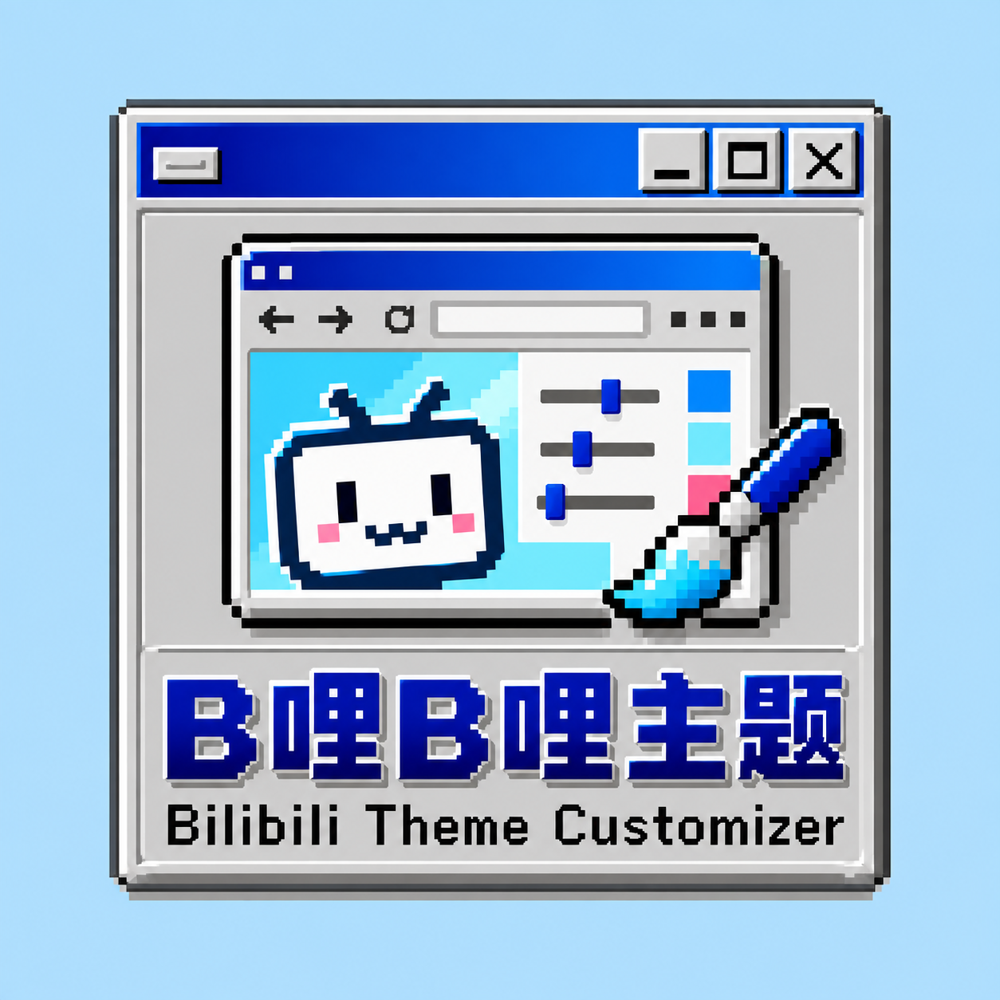

  
  <h1>B哩B哩主题 / Bilibili Theme Customizer</h1>
  
给哔哩哔哩换上你的壁纸和玻璃质感。 Make Bilibili look and feel like yours.

  

    <kbd>🖥️ Chrome / Edge</kbd>
    <kbd>🪟 Windows 98 UI</kbd>
    <kbd>🌐 中文 / English</kbd>
    <kbd>🔒 Local only</kbd>
  

  
<a href="#zh">中文介绍</a> · <a href="#en">English guide</a>

---

## 🇨🇳 中文

这是一个 Chrome / Edge 扩展，可以自定义哔哩哔哩的背景、界面材质和部分导航按钮。控制面板采用 Windows 98 风格，设置保存在浏览器本地。

### ✨ 功能介绍

| 功能 | 说明 |
| --- | --- |
| 🖼️ 自定义背景 | 上传 PNG、JPG、WebP、AVIF、GIF 或 MP4。每个文件最大 **20 MB**。静态图片会缩放并转换为 WebP；GIF 保留动画；MP4 静音循环播放，切走标签页时暂停。 |
| 🧊 毛玻璃与透明 | 在“毛玻璃”和“透明”之间切换，调整玻璃浓度、模糊强度和点缀色。可选择全元素或内容面板范围。 |
| 🎨 字体颜色 | 自定义网页文字颜色；输入框底色会随所选文字颜色调整。 |
| 🧭 导航整理 | 分别隐藏顶部左侧、首页频道图标、分类、快捷入口、更多频道和悬浮工具栏中的项目；支持一键隐藏或显示整组。 |
| 🪟 站内界面 | 搜索建议、悬浮菜单、个人资料卡、视频简介和评论区等区域也会应用主题效果。 |
| 🌐 双语面板 | 首次使用跟随浏览器语言，也可在弹窗中手动选择中文或 English。 |

### 🚀 安装教程

1. 下载或克隆本项目，保留整个文件夹，包括 `assets` 目录。
2. Chrome 打开 `chrome://extensions/`；Edge 打开 `edge://extensions/`。
3. 打开右上角的**开发者模式**，点击**加载已解压的扩展程序**。
4. 选择**包含 `manifest.json` 的项目文件夹**，不是 `assets` 子文件夹。
5. 打开或刷新哔哩哔哩网页，点击浏览器工具栏中的扩展图标设置背景和效果。

> [!TIP]
> 修改插件文件后，先在扩展管理页点击**重新加载**，再刷新哔哩哔哩标签页。只关闭并重开设置弹窗不会更新网页脚本。

### 🔐 文件与权限

图片和视频只保存在浏览器本地，不会由本插件上传。`storage` 用于保存设置；`unlimitedStorage` 用于容纳最大 20 MB 的背景文件。无需 Node.js、npm 或构建步骤。

🛠️ 点击隐藏按钮没反应，或出现 settings.js 加载错误？

先检查弹窗底部和扩展管理页的错误信息。确认扩展加载的是当前项目文件夹，在扩展管理页点击**重新加载**，然后刷新已打开的哔哩哔哩页面。如果错误列表里只剩旧记录，可以清除记录后再看错误是否重现。

---

## 🌍 English

A Chrome / Edge extension for customizing Bilibili backgrounds, glass effects, and selected navigation controls. Its settings panel has a Windows 98 style, and settings stay in your browser.

### ✨ Features

| Feature | Description |
| --- | --- |
| 🖼️ Custom backgrounds | Upload PNG, JPG, WebP, AVIF, GIF, or MP4 files up to **20 MB each**. Static images are resized and converted to WebP. GIFs remain animated. MP4 videos loop silently and pause when the tab is hidden. |
| 🧊 Frosted glass or clear | Choose a frosted or transparent interface, then adjust opacity, blur, accent color, and whether the effect covers all elements or content panels. |
| 🎨 Text color | Pick a page text color. Input backgrounds adapt to keep the text readable. |
| 🧭 Navigation controls | Hide individual items in the top-left navigation, home channels, shortcuts, More menu, and floating toolbar. Hide or show an entire group with one click. |
| 🪟 Site UI | The theme also styles search suggestions, hover menus, profile cards, video descriptions, and comments. |
| 🌐 Two languages | Follow the browser language at first launch, or choose 中文 / English in the popup. |

### 🚀 Installation

1. Download or clone this project. Keep the whole folder, including `assets`.
2. Open `chrome://extensions/` in Chrome or `edge://extensions/` in Edge.
3. Enable **Developer mode**, then click **Load unpacked**.
4. Select the **project folder containing `manifest.json`**, not the `assets` subfolder.
5. Open or refresh Bilibili and click the extension icon in the browser toolbar.

> [!TIP]
> After changing extension files, click **Reload** on the extensions page, then refresh your Bilibili tabs. Reopening the popup alone does not refresh scripts already running in a tab.

### 🔐 Local files and permissions

Background images and videos stay in local browser storage; this extension does not upload them. `storage` saves your settings, while `unlimitedStorage` allows background files up to 20 MB. No Node.js, npm, or build step is required.

🛠️ Hide buttons do nothing, or settings.js fails to load?

Check the popup status and errors on the extensions page. Make sure Chrome or Edge loaded the current project folder, click **Reload**, and refresh open Bilibili tabs. Clear old errors if needed, then check whether a new error appears.

---

## 📁 项目文件 / Project files

| 文件 / File | 用途 / Purpose |
| --- | --- |
| `manifest.json` | 扩展入口、权限和图标 / Extension entry, permissions, and icons |
| `popup.html` · `popup.css` · `popup.js` | 双语设置面板 / Bilingual settings popup |
| `content.js` | 网页背景与玻璃效果 / Page backgrounds and glass effects |
| `settings.js` | 共用设置和扩展后台 / Shared settings and service worker |
| `assets/logo.png` | 完整 Logo / Full logo |
| `assets/icon-16.png` · `icon-32.png` · `icon-48.png` · `icon-128.png` | 浏览器与弹窗图标 / Browser and popup icons |

## 📄 许可 / License

本项目使用 [GNU GPL v3](LICENSE) 许可。 / This project is licensed under the [GNU GPL v3](LICENSE).
